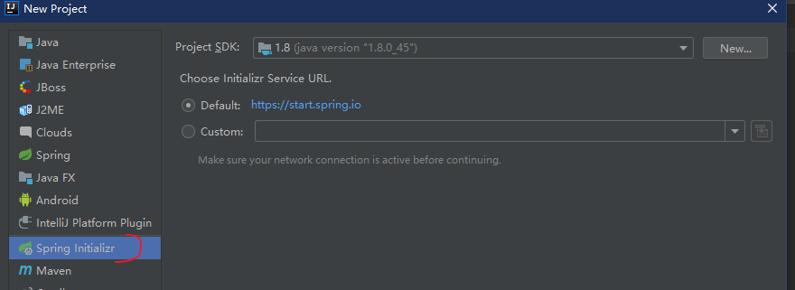
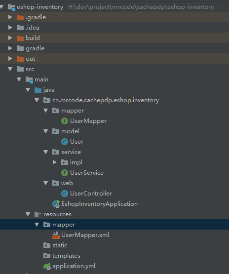

# 039. 库存服务的开发框架整合与搭建：spring boot + mybatis + jedis

::: tip
项目搭建，视频中使用 mavn，本笔记使用 gradle-4.8.1 + spring boot 2.1.3

gradle 版本的不同对于生成的 build.gradle 语法可能不太同

同样，对于 spring boot 来说，2.0.4 版本与 2.1.3 版本生成的 build.gradle 写法相差很大

本次练习项目 eshop-inventory 的 GitHub 地址
:::

本次使用 idea 的 Spring Initializr 工具辅助创建 gradle 项目




生成的 build.gradle 内容如下

```groovy
plugins {
    id 'org.springframework.boot' version '2.1.3.RELEASE'
    id 'java'
}

apply plugin: 'io.spring.dependency-management'

group = 'cn.mrcode.cachepdp'
version = '0.0.1-SNAPSHOT'
sourceCompatibility = '1.8'

repositories {
    maven { url 'https://repo.spring.io/libs-snapshot' }
    maven { url "http://maven.aliyun.com/nexus/content/groups/public" }
    maven { url "https://maven.repository.redhat.com/ga/" }
    maven { url "http://maven.nuiton.org/nexus/content/groups/releases/" }
    maven { url "https://repository.cloudera.com/artifactory/cloudera-repos/" }
    mavenCentral()
}

dependencies {
    implementation 'org.springframework.boot:spring-boot-starter-actuator'
    implementation 'org.springframework.boot:spring-boot-starter-jdbc'
    implementation 'org.springframework.boot:spring-boot-starter-thymeleaf'
    implementation 'org.springframework.boot:spring-boot-starter-web'
    implementation 'org.mybatis.spring.boot:mybatis-spring-boot-starter:2.0.0'
    runtimeOnly 'mysql:mysql-connector-java'
    testImplementation 'org.springframework.boot:spring-boot-starter-test'
    compile 'com.alibaba:fastjson:1.1.43'
}

```


```
# 增加数据库用户 eshop/eshop
grant all privileges on eshop.* to 'eshop'@'%' identified by 'eshop';

# 以下操作：创建库和创建表建议使用图形化工具创建，下面语句不完整，没有字符集会乱码
create database if not exists eshop;
use eshop;
# 创建 user 表
CREATE TABLE `user` (
  `name` varchar(255) CHARACTER SET utf8 DEFAULT NULL,
  `age` int(11) DEFAULT NULL
) ENGINE=MyISAM DEFAULT CHARSET=utf8;
insert into user values('张三', 25)
```

mybatis 整合测试

整个联通测试目录结构如图：



EshopInventoryApplication
```java
@SpringBootApplication
@MapperScan(value ="cn.mrcode.cachepdp.eshop.inventory.mapper")
public class EshopInventoryApplication {

    public static void main(String[] args) {
        SpringApplication.run(EshopInventoryApplication.class, args);
    }
}
```

application.yml

```yml
server:
  # 我这里指定 6000 会发现起来之后不能访问到
  port: 6001
logging:
  level:
    root: info
    # 可以打印 sql
    cn.mrcode.cachepdp.eshop.inventory: debug
#  path: ./
spring:
  datasource:
    driver-class-name: com.mysql.jdbc.Driver
    url: jdbc:mysql://192.168.99.173:3306/eshop?useUnicode=yes&characterEncoding=UTF-8&useSSL=false
    username: eshop
    password: eshop
  jackson:
    date-format: yyyy-MM-dd HH:mm:ss
    time-zone: GMT+8

mybatis:
#  type-aliases-package: cn.mrcode.cachepdp.eshop.inventory.model
  mapper-locations: classpath*:mapper/*.xml
```

UserMapper

```java
public interface UserMapper {
    User findUserInfo();
}
```
UserMapper.xml

```xml
<?xml version="1.0" encoding="UTF-8"?>
<!DOCTYPE mapper PUBLIC "-//mybatis.org//DTD Mapper 3.0//EN"
        "http://mybatis.org/dtd/mybatis-3-mapper.dtd">
<mapper namespace="cn.mrcode.cachepdp.eshop.inventory.mapper.UserMapper">
    <select id="findUserInfo" resultType="cn.mrcode.cachepdp.eshop.inventory.model.User">
	  select name,age from user;
    </select>
</mapper>
```

User

```java
public class User {
    private String name;
    private int age;

    public String getName() {
        return name;
    }

    public void setName(String name) {
        this.name = name;
    }

    public int getAge() {
        return age;
    }

    public void setAge(int age) {
        this.age = age;
    }
}
```

service

```java
public interface UserService {
    User getUserInfo();
}
@Service
public class UserServiceImpl implements UserService {
    @Autowired
    private UserMapper userMapper;

    @Override
    public User getUserInfo() {
        return userMapper.findUserInfo();
    }
}
```

```java
@RestController
public class UserController {
    @Autowired
    private UserService userService;

    @RequestMapping("/getUserInfo")
    @ResponseBody
    public User getUserInfo() {
        User user = userService.getUserInfo();
        return user;
    }
}
```

启动之后，能正常访问 http://localhost:6001/getUserInfo

## 整合 redis cluster

这里是使用 jedis 手动创建的 cluster 客户端

```
compile 'redis.clients:jedis'
```

直接在某个配置类中增加一个即可
```java
@Bean
public JedisCluster jedisCluster() {
    // 这里使用 redis-trib.rb check 192.168.99.170:7001 找到 3 个 master 节点，添加进来
    Set<HostAndPort> jedisClusterNodes = new HashSet<>();
    jedisClusterNodes.add(new HostAndPort("192.168.99.170", 7001));
    jedisClusterNodes.add(new HostAndPort("192.168.99.172", 7005));
    jedisClusterNodes.add(new HostAndPort("192.168.99.171", 7003));
    JedisCluster jedisCluster = new JedisCluster(jedisClusterNodes);
    return jedisCluster;
}
```
接下来写一个测试

```java
// RedisDAO 就是一个自定义的接口
@Repository
public class RedisDAOImpl implements RedisDAO {
    @Autowired
    private JedisCluster jedisCluster;

    @Override
    public void set(String key, String value) {
        jedisCluster.set(key, value);
    }

    @Override
    public String get(String key) {
        return jedisCluster.get(key);
    }
}

// 在 UserServiceImpl 中增加获取 缓存用户的信息
@Override
public User getCachedUserInfo() {
   redisDAO.set("cached_user", "{\"name\": \"zhangsan\", \"age\": 25}");
   String json = redisDAO.get("cached_user");
   JSONObject jsonObject = JSONObject.parseObject(json);

   User user = new User();
   user.setName(jsonObject.getString("name"));
   user.setAge(jsonObject.getInteger("age"));

   return user;
}

// 在 UserController 中增加获取接口
@RequestMapping("/getCachedUserInfo")
@ResponseBody
public User getCachedUserInfo() {
    User user = userService.getCachedUserInfo();
    return user;
}
```

启动后，访问成功即可表示整合成功

```
http://localhost:6001/getCachedUserInfo

{
  "name": "zhangsan",
  "age": 25
}
```


<iframe  height="500px" width="100%" frameborder=0 allowfullscreen="true" :src="$withBase('/ads.html')"></iframe>