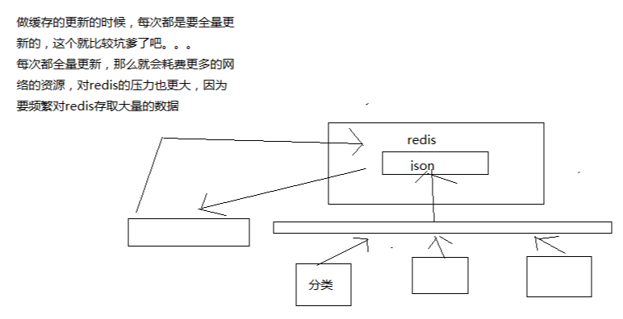

# 045. 商品详情页结构分析、缓存全量更新问题以及缓存维度化解决方案

我们讲解过，咱们的整个缓存的技术方案，分成两块

1. 实时性较高数据

    比如说库存，销量之类的这种数据，我们采取的实时的缓存+数据库双写的技术方案，双写一致性保障的方案

2. 实时性要求不高的数据

    比如说商品的基本信息，等等，我们采取的是三级缓存架构的技术方案，就是说由一个专门的数据生产的服务，去获取整个商品详情页需要的各种数据，经过处理后，将数据放入各级缓存中，每一级缓存都有自己的作用

我们先来看看一下，所谓的这种实时性要求不高的数据，在商品详情页中，都有哪些

## 大型电商网站中的商品详情页的数据结构分析

商品的基本信息

- 标题：【限时直降】Apple/苹果 iPhone 7 128G 全网通4G智能手机正品
- 短描述：限时优惠 原封国行 正品保障
- 颜色
- 存储容量
- 图片列表
- 规格参数

打开淘宝找一个 iPhone7 的商品详情页参考，这里只是一部分

其他信息：店铺信息、分类信息，等等，非商品维度的信息

商品介绍：放缓存，图片是懒加载的，不放我们这里讲解

实时信息：实时广告推荐、实时价格、实时活动推送，等等，ajax 加载，如我们前面做的库存缓存

我们不是带着大家用几十讲的时间去做一套完整的商品详情页的系统，电商网站的话，都几百个人做好几年的，所以这里主要还是架构思路

将商品的各种基本信息，分类放到缓存中，每次请求过来，动态从缓存中取数据，然后动态渲染到模板中

数据放缓存，性能高，动态渲染模板，灵活性好

## 大型缓存全量更新问题

上图是把一个详情页的信息都拼成一个 json 串放一个 value 中，
那么这样只要有其中一点信息更改，就需要全部取出来，更新后，再放回去。
这样做的缺点有：

- 网络耗费的资源大
- 每次对redis 都存取大数据，对 redis 的压力也比较大
- redis 的性能和吞吐量能够支撑到多大，基本跟数据本身的大小有很大的关系

    如果数据越大，那么可能导致 redis 的吞吐量就会急剧下降

可以使用缓存维度化来解决
## 缓存维度化解决方案
维度：比如商品基本信息维度、商品分类维度、商品店铺维度

不同的维度，可以看做是不同的角度去观察一个东西，那么每个商品详情页中，都包含了不同的维度数据

举个例子：如果不维度化，就导致多个维度的数据混合在一个缓存 value 中，但是不同维度的数据，可能更新的频率都大不一样

比如，现在只是将 1000 个商品的分类批量调整了一下，但是如果商品分类的数据和商品本身的数据混杂在一起，那么可能导致需要将包括商品在内的大缓存 value 取出来，进行更新，再写回去，就会很坑爹，耗费大量的资源，redis 压力也很大

但是如果我们对缓存进行维度化：将每个维度的数据都存一份，比如说商品维度的数据存一份，商品分类的数据存一份，商品店铺的数据存一份，那么在不同的维度数据更新的时候，只要去更新对应的维度就可以了

包括我们之前讲解的那种实时性较高的数据，也可以理解为一个维度，那么维度拆分后如下图

这样一来就解决了，全量更新的问题

<iframe  height="500px" width="100%" frameborder=0 allowfullscreen="true" :src="$withBase('/ads.html')"></iframe>