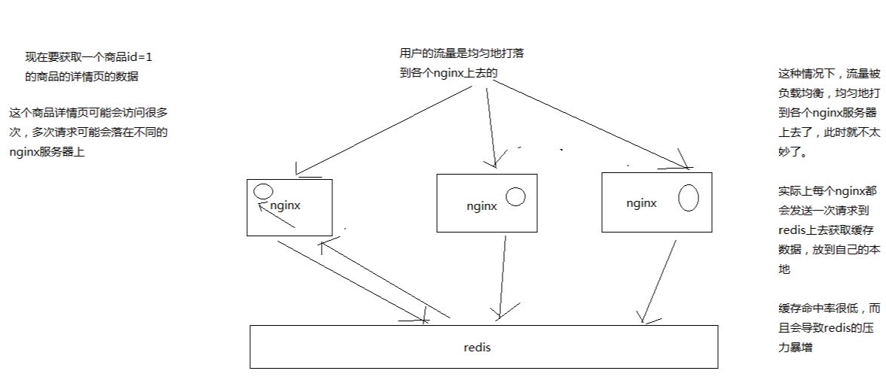
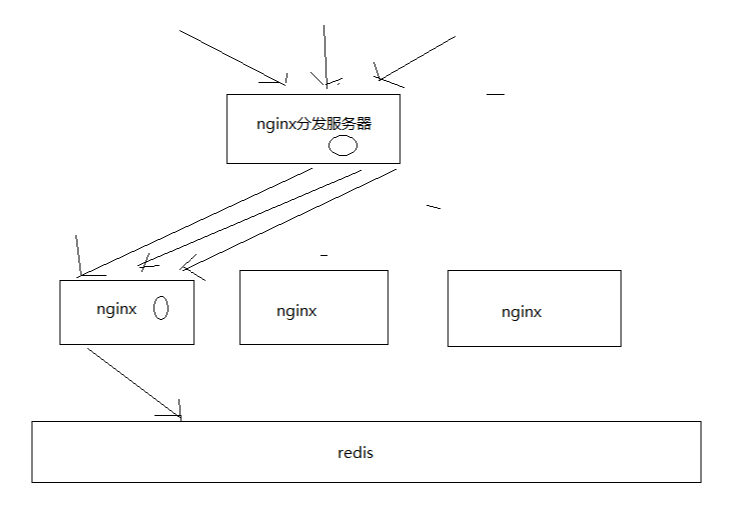

# 051. 基于“分发层 + 应用层”双层 nginx 架构提升缓存命中率方案分析
缓存数据生产服务那一层已经搞定了，相当于三层缓存架构中的本地堆缓存 + redis 分布式缓存都搞定了

就要来做三级缓存中的 nginx 那一层的缓存了
## 缓存命中率低
如果一般来说，你默认会部署多个 nginx，在里面都会放一些缓存，就默认情况下，此时缓存命中率是比较低的

如上图，被均衡分发了，所以命中率很低。

## 如何提升缓存命中率？
方案：分发层+应用层，双层 nginx

分发层 nginx，负责流量分发的逻辑和策略，这个里面它可以根据你自己定义的一些规则，
比如根据 productId 去进行 hash，然后对后端的 nginx 数量取模，将某一个商品的访问的请求，
就固定路由到一个 nginx 后端服务器上去，保证说只会从 redis 中获取一次缓存数据，
后面全都是走 nginx 本地缓存了

后端的 nginx 服务器，就称之为应用服务器; 最前端的 nginx 服务器，被称之为分发服务器

看似很简单，其实很有用，在实际的生产环境中，可以大幅度提升你的 nginx 本地缓存这一层的命中率，
大幅度减少 redis 后端的压力，提升性能

::: tip 疑问
到现在我都有好多疑问，是基于自己使用 spring cloud 来看待这种路由到固定的机器上面去，
其实这就相当于有状态了，在缓冲架构里面他的确能解决缓存命中问题，但是在灵活性上，
增加服务，减少服务就有问题了。 这个疑问现在还不是特别的明确，后续再看吧
:::

<iframe  height="500px" width="100%" frameborder=0 allowfullscreen="true" :src="$withBase('/ads.html')"></iframe>