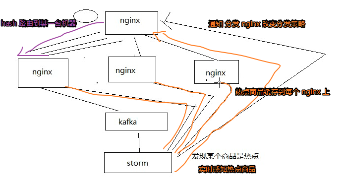

# 077. 基于 nginx+lua+storm 的热点缓存的流量分发策略自动降级解决方案

## 热点缓存的根本原因
根本原因是，在获取商品信息的时候，分发层 nginx 是根据 hash 策略路由到 应用层 nginx 中的，
包括一系列的缓存重建（之前的课程中我也是有很多疑问的，这里假定说方案是完美的）。

由于路由策略问题，导致某一个商品（如秒杀）全部分发都相同的机器上了，导致机器扛不住。

简而言之：路由策略路由到某一台机器，导致该机器扛不住这么多的访问量

那么这里的解决方案是：hash 单一路由降级为随机路由

## 自动降级路由策略要点

1. 热点商品依据是什么？
2. 什么时机进行降级？

下面解决这两个要点来探讨

### 使用 storm 实时计算出瞬时出现的热点

有多重算法，这里介绍一种简单的。

我们的商品访问次数存放在 LRUMAP 中，并且定时计算 topn 上传到 zk 中。
那么对于瞬时热点数据来说，统计频率需要变得再高一点，比如 5 秒一次统计。

核心思路：

1. 对 LRUMAP 中数据进行排序，计算出后 95% 的商品平均访问值
2. 设置热点商品阈值

    前百分之 5 的商品访问次数对于这个平均访问值倍数差，
    如：平均访问值是 100，阈值是 5倍，那么超过 500 访问量的商品则视为热点商品

    该商品可能在短时间内继续扩大访问量，超过阈值 n 倍

热点数据和热数据不是一个概念：

- 热数据：之前做的 topn ，视为热数据
- 热点数据：热数据中的某个商品访问量，瞬间超出了普通商品的 n 倍，视为热点数据

### 热点数据上报分发层 nginx
热点数据计算出来后，也就是被 storm 实时计算感知到了，那么就可以上报到 nginx 了

storm 发送 htpp 请求到 nginx 上，用 lua 脚本处理请求，拉取缓存热点商品缓存数据
缓存到 nginx 上。

### 分发层 nginx 降级（改变）流量分发策略
现在所有 nginx 上都缓存了热点商品缓存，但是由于 hash 流量分发策略，并不能让所有 nginx
为之服务，所以需要对热点商品改变流量分发策略，让所有请求均衡的分发到所有 nginx 上

本列中使用随机分发策略。自己可以扩展一下均衡负载相关算法。

### 热点商品生命周期管理

不能说长期的把这些商品缓存和流量降级策略长期保持，还需要 storm 进行计算感知，
如秒杀过后，该商品的访问量其实就降低到了普通商品访问量了，
这个时候就需要通知 nginx 取消降级和清楚该商品缓存

实现思路可以是：

1. 下次去识别的时候，这次的热点 list 跟上次的热点 list 做一下 diff，看看可能有的商品已经不是热点了；

    很重要的一点，有一个前置条件一定要记得：我们使用了 LRUMap，最近最少使用在达到 Map 最大条目时，
    最近未被使用的会被驱逐，这个也能反映某一段时间内该商品不是热点数据了。最少的更加不是热点商品数据了

    所以这里可以保存上一次的热点列表，做 diff，然后执行取消热点逻辑
2. 热点的取消的逻辑，发送 http 请求到流量分发的 nginx 上去，取消掉对应的热点数据，从 nginx 本地缓存中删除

具体逻辑细节只能代码中见分晓了

## 总结

1. 热点商品和热点数据概念不一致，热点是瞬时访问量达到一定阈值
2. 热点问题是由于路由分发策略导致几种在一台服务器，服务器承受不住访问，导致崩溃
3. 解决方案：实时感知热点，自动降级策略，征用其他 nginx 本地缓存，其他 nginx 为之服务

热点商品解决方案示意图：

<iframe  height="500px" width="100%" frameborder=0 allowfullscreen="true" :src="$withBase('/ads.html')"></iframe>