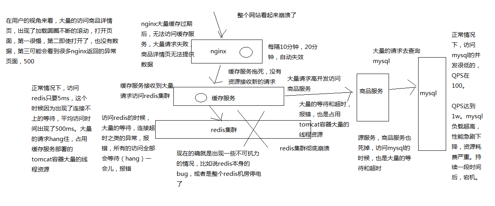

# 110. 高并发场景下恐怖的缓存雪崩现象以及导致系统全盘崩溃的后果

## 什么是缓存雪崩？
简单说：由于缓存不可用，导致大量请求访问后端服务，可能 mysql 扛不住高并发而打死，
像滚雪球一样，影响越来越大，最后导致整个网站崩溃不可用

至于为什么会像滚雪球一样？整个与整个系统的架构有关；
比如在这之前讲解的知识点（本教程 001~060 章内容），根据这个背景来讲解下雪崩过程

1. redis 集群彻底崩溃：不可用
2. 缓存服务在请求 redis 时，会有大量的线程阻塞，占用资源
3. 超时请求失败之后，会去 mysql 查询原始数据，mysql 抗不住，被打死
4. 源头服务由于 mysql 被打死，对源服务的请求也被阻塞，占用资源
5. 缓存服务大量的资源全部耗费在访问 redis 和 源服务上；最后自己被拖死，无法提供服务
6. nginx 无法访问缓存服务，只能基于本地缓存提供服务，当缓存过期后，就耗费在访问缓存服务上
7. 最后整个网站崩溃，页面加载不出来任何数据

以下是这个流程的一个图解

## 行业真实的缓存雪崩经验和教训
某电商，之前就是出现过，整个缓存的集群彻底崩溃了，因为主要是集群本身的 bug，导致自己把自己给弄死了，虽然当时也是部署了双机房的，但是还是死了

该电商几乎所有的应用都是基于那个缓存集群去开发的，导致各种服务的线程资源全部被耗尽，然后用在了访问那个缓存集群时的等待、超时和报错上了；然后导致各种服务就没有资源对外提供服务

再加上各种降级措施也没做好，直接就是整体系统的全盘崩溃；导致网站就没法对外出售商品，导致了很大数额的经济的损失

<iframe  height="500px" width="100%" frameborder=0 allowfullscreen="true" :src="$withBase('/ads.html')"></iframe>