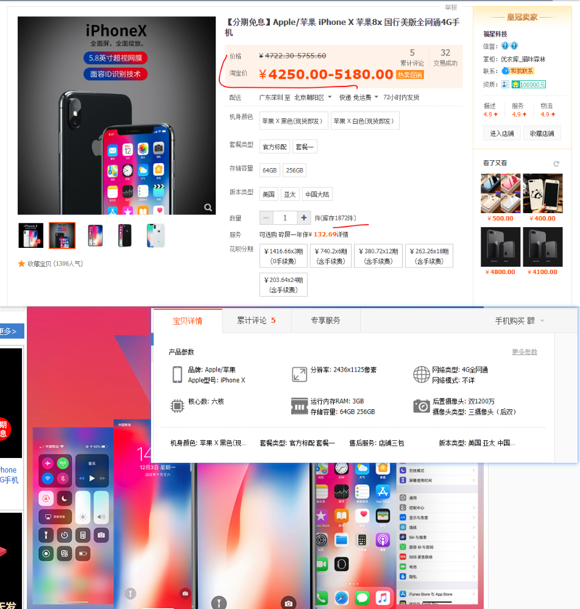

# 124. 大型电商网站的商品详情页的深入分析（第二版开始）

## 说明
之前，在讲解这个商品详情页系统的架构，着重点是：缓存架构、高可用服务 相关思路与技术深入讲解

商品详情页系统，我们只是抽取了其中一部分来讲解，而且还做了很大程度的简化，
主要是为了用一个较为拟真的这么一个业务场景，重点是要讲解：缓存架构、高可用服务（hystrix）

在讲解完了之前的内容之后，相信大家也都掌握了一定的基础了，然后接下来我们就要去动手纯实战，
去开发出来一个较为完整的亿级流量大型电商网站的商品详情页系统

升级内容（也就是第二版）：

1. 纯实战：我们不会过多的讲解一些技术（redis、缓存架构、hystrix 高可用服务），在第一章中对 redis 和 hystrix 都是对技术的深入讲解
2. 技术讲解过多了，对于我们这样的一套单品课程来说，自然在第一版的时候，业务和完整架构自然讲解就少了
3. 这次升级，策略跟第一版不同，重点就是完整架构的项目实战，亿级流量电商详情页系统架构的完整架构的项目实战
4. 纯实战，做东西，不会深入讲解任何技术
5. 对于中间件依赖部署，简单的讲解，开始做

## 商品详情页介绍

### 商品详情页的多模板化
多套模板：聚划算、天猫超时、淘抢购、电器城

不同模板的元数据大部分是一样的，只是展示方式不一样，
不同的业务，商品学详情页的个性化需求很多，数据来源也很多

### 商品详情页结构
拿一个淘宝详情页来举例

#### 时效性比较低的数据
一个详情页包含了不同的维度（也就是各种各样的数据）

- 商品维度：标题、图片、属性 等等
- 主商品维度：商品介绍、规格参数 等等

    对于没有做过电商的我来说，还是不理解，后来工作中一个业务需求才让我明白：颜色与尺码的笛卡尔积组成了不同的 sku，
    一般来看商品介绍、规则参数等都是公用的，而颜色与尺码又组成了一个 sku 概念，但是他们没有独立的商品介绍
- 分类维度：分类列表
- 商家维度

针对这些数据，采用的方案（后面会详细讲解）是当一个商品详情页被访问到的时候，
将数据动态渲染/填充到一个 html 模板中去，因为在浏览器展现的时候，数据写死在 html 中的，
直接就显示出来了。

比如一个商品的数据变更了，可能是异步的去更新数据的，可能需要 5 分钟，或者 10 分钟，才能将变更的数据反映的商品详情页中去；

这种形式在前端中来说就是 SSR（服务端渲染）

#### 时效性比较高的数据
实时价格、实时促销、广告词、配送至 xxx、预售、库存 等数据，变更频繁，实时要求较高

针对于这类数据通过 ajax 异步加载，在访问商品详情页的时候，
价格、库存、促销活动、广告词，都没有直接写死到 html 中，直接是在 html 里放了一个 js 脚本，
html 在浏览器显示出来的时候，js 脚本运行发送 ajax 请求到后端，后端接口直接查询相关数据返回。

只要变更了数据，那么在下一次商品详情页展示的时候，一定可以将最新的数据展示出来

在淘宝网上展示一个通用商品模板，商品详情页结构拆解说明，分析一个商品详情页的多维度构成

## 亿级流量电商网站的商品详情页访问情况和特点
- 访问量：比如双 11 活动，商品详情页的 pv 至少达到几亿次，但是经过良好设计的详情页系统，响应时间小于几十毫秒
- 访问特点：离散访问，特点数据少

一般来说访问比较均匀，很少说集中式访问某个商品详情页，除非是那种秒杀活动，
那是集中式访问某个商品详情页

<iframe  height="500px" width="100%" frameborder=0 allowfullscreen="true" :src="$withBase('/ads.html')"></iframe>