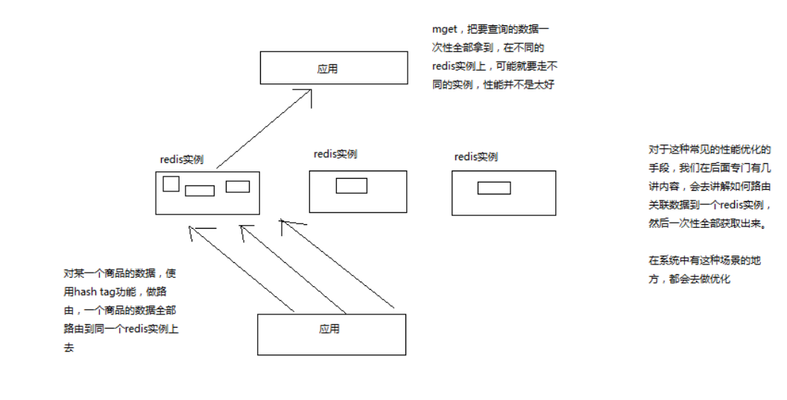

# 131. 商品详情页动态渲染系统：redis 批量查询性能优化设计

由于是 redis 集群，所以在存储维度数据的时候（商品价格、描述等维度），
可能会被自动路由到多个 redis 节点上，可以使用 hash tag 功能强制路由到一个节点上，
再配合 mget 语法批量获取到

<iframe  height="500px" width="100%" frameborder=0 allowfullscreen="true" :src="$withBase('/ads.html')"></iframe>