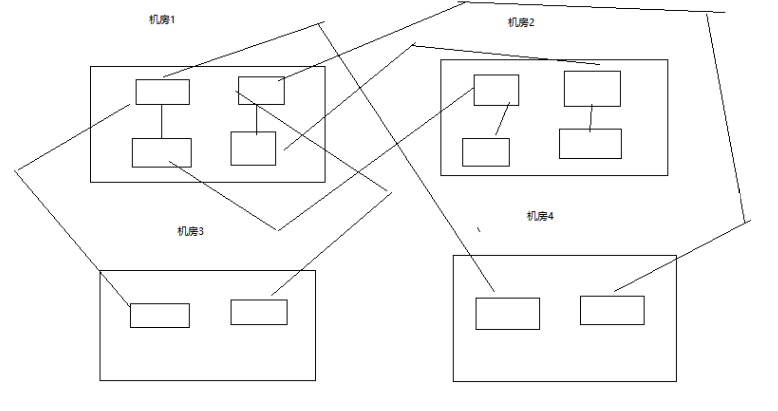

# 140. 商品详情页动态渲染系统：给每个机房部署一个 redis 从集群


之前的架构中是双机房，一个主集群，一个从集群。在架构链路上，从集群作为缓存中的第二级缓存，
[这个在之前的架构中有说明](./134.md)

由于我们把机器压缩了，两个机房的主部署到了一台机器上。这一点不要搞混淆了。

接下来，再部署两个 redis 从，来看下现在 redis 实例的分布

```
                             ← 192.168.99.12 slave: 6405  并列作为 6401 的从
192.168.99.11 master：6401   ← 192.168.99.11 slave: 6405
192.168.99.11 slave: 6403 ↑
192.168.99.12 slave: 6401 ↑
192.168.99.12 slave: 6403 ↑

                             ← 192.168.99.12 slave: 6406  并列作为 6402 的从
192.168.99.11 master：6402   ← 192.168.99.11 slave: 6406
192.168.99.11 slave: 6404 ↑
192.168.99.12 slave: 6402 ↑
192.168.99.12 slave: 6404 ↑
```

来看下挂载的主从信息

```
[root@eshop-detail01 redis-2.8.19]# src/redis-cli -p 6401
127.0.0.1:6401> info replication
# Replication
role:master
connected_slaves:3 # 3 个从，和上面示意的一模一样
slave0:ip=192.168.99.11,port=6403,state=online,offset=3007,lag=0 # 树形从
slave1:ip=192.168.99.11,port=6405,state=online,offset=3007,lag=0 # 单节点从
slave2:ip=192.168.99.12,port=6405,state=online,offset=3007,lag=1 # 机房2单节点从
master_repl_offset:3007
repl_backlog_active:1
repl_backlog_size:1048576
repl_backlog_first_byte_offset:2
repl_backlog_histlen:3006
```

搭建成功；注意这里部署的 redis 通过主从复制只实现了读写分离，但是并没有实现大数据量的存储，
所以后面会使用中间件来把两个主集群结合起来，组成一个分布式 redis 主集群

::: tip 疑问
现在一个 master 有 3 个从，当 master 挂掉之后，会变成什么样子？
:::


<iframe  height="500px" width="100%" frameborder=0 allowfullscreen="true" :src="$withBase('/ads.html')"></iframe>