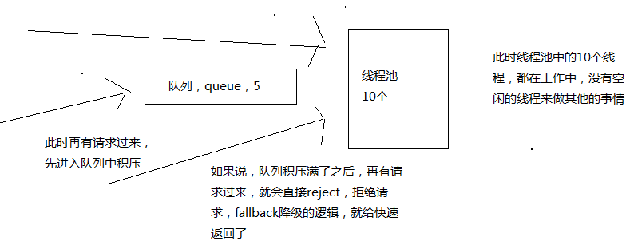

# 092. hystrix 的线程池+服务+接口划分以及资源池的容量大小控制

资源隔离的两种策略：线程池和信号量

本章对资源隔离进一步讲解，进行细粒度的控制配置

## execution.isolation.strategy 隔离策略配置

- THREAD 线程池机制：每个 command 运行在一个线程中，限流是通过线程池的大小来控制的
- SEMAPHORE 信号量机制：command 是运行在调用线程中，但是通过信号量的容量来进行限流

如何在线程池和信号量之间做选择？

默认的策略就是线程池

- 线程池

    最大的好处就是对于网络访问请求，如果有超时的话，可以避免调用线程阻塞住
- 信号量

    通常是针对超大并发量的场景下，每个服务实例每秒都几百的 QPS，那么此时你用线程池的话，线程一般不会太多，可能撑不住那么高的并发，如果要撑住，可能要耗费大量的线程资源，那么就是用信号量，来进行限流保护（这种理解也能说得通）

    一般用信号量常见于那种基于纯内存的一些业务逻辑服务，而不涉及到任何网络访问请求

    netflix 有 100+ 的 command 运行在 40+ 的线程池中，只有少数 command 是不运行在线程池中的，就是从纯内存中获取一些元数据，或者是对多个 command 包装起来的 facacde command，是用信号量限流的

```java
super(Setter.withGroupKey(HystrixCommandGroupKey.Factory.asKey("GetProductCommandGroup"))
        .andCommandPropertiesDefaults(
                HystrixCommandProperties.Setter()
                        .withExecutionIsolationStrategy(HystrixCommandProperties.ExecutionIsolationStrategy.THREAD)
        )
);
```

## command 名称和 command 组

主要用来更细粒度的控制依赖服务接口线程池如何来划分

```java
super(Setter.withGroupKey(HystrixCommandGroupKey.Factory.asKey("GetProductCommandGroup"))
        .andCommandKey(HystrixCommandKey.Factory.asKey("GetProductCommand"))
);
```

command group 是一个非常重要的概念，默认情况下，是通过 command group 来定义一个线程池的，而且还会通过 command group 来聚合一些监控和报警信息，同一个 command group 中的请求，都会进入同一个线程池中

## command 线程池
threadpool key 代表了一个 HystrixThreadPool，用来进行统一监控、统计、缓存，默认的 threadpool key 就是 command group 名称；每个 command 都会跟它的 threadpool key 对应的 thread pool 绑定在一起

```java
super(Setter.withGroupKey(HystrixCommandGroupKey.Factory.asKey("GetProductCommandGroup"))
        .andCommandKey(HystrixCommandKey.Factory.asKey("GetProductCommand"))
        .andThreadPoolKey(HystrixThreadPoolKey.Factory.asKey("HelloWorldPool"))
);
```

## 三种 key 含义
- command key：代表了一类 command，一般来说代表了底层的依赖服务的一个接口
- group key：代表了某一个底层的依赖服务

    一个依赖服务可能会暴露出来多个接口，每个接口就是一个 command key

    在逻辑上去组织起来一堆 command key 的调用、统计信息、成功次数、timeout 超时次数、失败次数、可以看到某一个服务整体的一些访问情况

    一般来说，推荐是根据一个服务去划分出一个线程池，command key 默认都是属于同一个线程池的

    比如说你以一个服务为粒度，估算出来这个服务每秒的所有接口加起来的整体 QPS 在 100 左右，
    该服务部署了 10 个实例。每个实例该 group key 服务给 10 个左右线程就可以了，
    整个集群服务的 QPS 就是 10 * 10 = 100

    一般来说 group key 是用来在逻辑上组合一堆 command 的；
    举个例子，对于一个服务中的某个功能模块来说，希望将这个功能模块内的所有 command 放在一个 group 中，那么在监控和报警的时候可以放一起看

    group key 对应了一个服务，但是这个服务暴露出来的几个接口，访问量很不一样，差异非常之大，
    你可能就希望在这个服务 group key 内部的多个 command key，做一些细粒度的资源隔离，
    那么久需要用到 threadpool key 了
- threadpool key

    threadpool key 是 command key 的上层；层级结构是这样的：group key -> threadpool key -> command key

    逻辑上来说，多个 command key 属于一个 command group，在做统计的时候会放在一起统计

    每个 command key 有自己的线程池，每个接口有自己的线程池，去做资源隔离和限流

    但是对于 thread pool 资源隔离来说，可能是希望能够拆分的更加一致一些，比如在一个功能模块内，对不同的请求可以使用不同的 thread pool

    command group 一般来说，可以是对应一个服务，多个 command key 对应这个服务的多个接口，多个接口的调用共享同一个线程池

## coreSize

这是线程池的大小，默认是 10

```java
super(Setter.withGroupKey(HystrixCommandGroupKey.Factory.asKey("GetProductCommandGroup"))
        .andThreadPoolPropertiesDefaults(
                HystrixThreadPoolProperties.Setter()
                        .withCoreSize(10)
        )
);
```

一般来说，用这个默认的10个线程大小就够了

## queueSizeRejectionThreshold
该配置涉及到一个工作原理，这里画图简单讲解下



控制 queue 满后 reject(拒绝) 的 threshold，因为 maxQueueSize 不允许热修改，因此提供这个参数可以热修改，控制队列的最大大小

```java
super(Setter.withGroupKey(HystrixCommandGroupKey.Factory.asKey("GetProductCommandGroup"))
        .andThreadPoolPropertiesDefaults(
                HystrixThreadPoolProperties.Setter()
                        .withCoreSize(10)
                        // 不能热修改
                        // com.netflix.hystrix.HystrixThreadPoolProperties.maxQueueSize 源码中有注释说明
                        .withMaxQueueSize(20)
                        // 可以热修改,默认值是 5
                        .withQueueSizeRejectionThreshold(10)
        )
);
```

## execution.isolation.semaphore.maxConcurrentRequests

设置使用 SEMAPHORE 隔离策略的时候，允许访问的最大并发量，超过这个最大并发量，请求直接被 reject

这个并发量的设置，跟线程池大小的设置，应该是类似的，但是基于信号量的话，性能会好很多，而且 hystrix 框架本身的开销会小很多

默认值是 10，设置的小一些，否则因为信号量是基于调用线程去执行 command 的，而且不能从 timeout 中抽离，因此一旦设置的太大，而且有延时发生，可能瞬间导致 tomcat 本身的线程资源本占满

不能从 timeout 中抽离是什么意思（前面章节私自提前了解了一点配置，实测有超时效果）？

```java
super(Setter.withGroupKey(HystrixCommandGroupKey.Factory.asKey("GetProductCommandGroup"))
               // 超时时间
               .andCommandPropertiesDefaults(HystrixCommandProperties.Setter()
                       .withExecutionTimeoutInMilliseconds(6000)
                       .withExecutionIsolationStrategy(HystrixCommandProperties.ExecutionIsolationStrategy.SEMAPHORE)
                       // 信号量最大请求数量设置
                       .withExecutionIsolationSemaphoreMaxConcurrentRequests(2)
               )

       );
```


<iframe  height="500px" width="100%" frameborder=0 allowfullscreen="true" :src="$withBase('/ads.html')"></iframe>