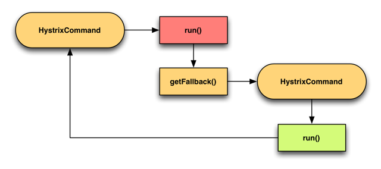

# 103. 基于双层嵌套 command 开发商品服务接口的多级降级机制
## 多级降级机制
顾名思义就是有多种降级方案呢，这里使用 2 级；
就是 一个正常 command 中 fallback 调用另外 command；

常见的多级降级做法，如：

1. 访问 mysql 数据库，但是访问报错
2. 降级去 redis 中获取数据，由于是通过网络，有可能也报错
3. 再次降级从本地 ehcache 中获取数据

通过下面官网小例子代码，非常方便的能看出来这个多级降级是怎么回事
## Fallback: Cache via Network

> [官网直达](https://github.com/Netflix/Hystrix/wiki/How-To-Use#fallback-cache-via-network)

有时，如果后端服务失败，可以从 memcached 等缓存服务检索过时的数据版本。
由于 failback 将通过网络传递，这是另一个可能的故障点，因此还需要使用 HystrixCommand或 HystrixObservableCommand 对其进行包装。



```java{28,29,30}
public class CommandWithFallbackViaNetwork extends HystrixCommand<String> {
    private final int id;

    protected CommandWithFallbackViaNetwork(int id) {
        super(Setter.withGroupKey(HystrixCommandGroupKey.Factory.asKey("RemoteServiceX"))
                .andCommandKey(HystrixCommandKey.Factory.asKey("GetValueCommand")));
        this.id = id;
    }

    @Override
    protected String run() {
        //        RemoteServiceXClient.getValue(id);
        throw new RuntimeException("force failure for example");
    }

    @Override
    protected String getFallback() {
      // 降级机制执行了另外一个 command
        return new FallbackViaNetwork(id).execute();
    }

    private static class FallbackViaNetwork extends HystrixCommand<String> {
        private final int id;

        public FallbackViaNetwork(int id) {
            super(Setter.withGroupKey(HystrixCommandGroupKey.Factory.asKey("RemoteServiceX"))
                    .andCommandKey(HystrixCommandKey.Factory.asKey("GetValueFallbackCommand"))
                    // 注意这里：需要使用和正常 command 不一样的线程池
                    // 因为正常 comman 执行降级的话有可能是因为线程池满了导致的
                    .andThreadPoolKey(HystrixThreadPoolKey.Factory.asKey("RemoteServiceXFallback")));
            this.id = id;
        }

        @Override
        protected String run() {
            // 第一级降级策略：通过网络获取数据
            MemCacheClient.getValue(id);
        }

        @Override
        protected String getFallback() {
            // 第二级降级策略：可以使用 stubbed fallback 方案返回残缺的数据
            // 也可以返回一个 null
            return null;
        }
    }
}
```

把这个降级机制运用到我们的业务中

## 商品服务接口，使用多级降级策略

商品接口拉取 command，主流程是从主机房去访问商品服务，如果主机房的服务出现了故障（如机房断电，机房的网络负载过高，机器硬件出了故障）

- 第一级降级策略：去访问备用机房的服务
- 第二级降级策略：用 stubbed fallback 降级策略，比较常用的，返回一些残缺的数据回去

```java
package cn.mrcode.cachepdp.eshop.cache.ha.hystrix.command;

import com.alibaba.fastjson.JSON;
import com.netflix.hystrix.HystrixCommand;
import com.netflix.hystrix.HystrixCommandGroupKey;
import com.netflix.hystrix.HystrixThreadPoolKey;

import cn.mrcode.cachepdp.eshop.cache.ha.http.HttpClientUtils;
import cn.mrcode.cachepdp.eshop.cache.ha.model.ProductInfo;

/**
 * ${todo}
 *
 * @author : zhuqiang
 * @date : 2019/6/1 23:45
 */
public class GetProductCommand2 extends HystrixCommand<ProductInfo> {
    private Long productId;

    public GetProductCommand2(Long productId) {
        super(Setter.withGroupKey(HystrixCommandGroupKey.Factory.asKey("GetProductCommandGroup"))
                // 不同的线程池
                .andThreadPoolKey(HystrixThreadPoolKey.Factory.asKey("GetProductCommand2Pool"))

        );
        this.productId = productId;
    }

    @Override
    protected String getCacheKey() {
        return String.valueOf(productId);
    }

    @Override
    protected ProductInfo run() throws Exception {
        System.out.println("正常流程获取");
        if (productId == 2) {
            throw new RuntimeException("模拟正常流程获取失败");
        }
        String url = "http://localhost:7000/getProduct?productId=" + productId;
        String response = HttpClientUtils.sendGetRequest(url);
        return JSON.parseObject(response, ProductInfo.class);
    }

    @Override
    protected ProductInfo getFallback() {
        System.out.println("正常流程降级策略");
        return new CommandWithFallbackViaNetwork(productId).execute();
    }

    public class CommandWithFallbackViaNetwork extends HystrixCommand<ProductInfo> {
        private Long productId;

        protected CommandWithFallbackViaNetwork(Long productId) {
            super(Setter.withGroupKey(HystrixCommandGroupKey.Factory.asKey("CommandWithFallbackViaNetworkGroup"))
                    // 不同的线程池
                    .andThreadPoolKey(HystrixThreadPoolKey.Factory.asKey("CommandWithFallbackViaNetworkPool"))

            );
        }

        @Override
        protected ProductInfo run() throws Exception {
            System.out.println("第一级降级");
            if (productId == 2) {
                throw new RuntimeException("模拟一级策略获取失败");
            }
            // 第一级降级策略：本来是该调用另外一个机房的服务
            // 我们这里没有另外的机房，还是调用原来的服务
            String url = "http://localhost:7000/getProduct?productId=" + productId;
            String response = HttpClientUtils.sendGetRequest(url);
            return JSON.parseObject(response, ProductInfo.class);
        }

        @Override
        protected ProductInfo getFallback() {
            System.out.println("第二级降级");
            // 第二级降级策略：使用残缺模式返回数据
            ProductInfo productInfo = new ProductInfo();
            productInfo.setId(productId);
            // 下面的数据可以从本地 ehcache 中获取数据填充后返回
            productInfo.setName("二级降级：残缺数据");
            return productInfo;
        }
    }
}
```

测试地址：`http://localhost:7001/getProduct?productId=2` (在对应 Controller 中调用就不贴了)

输出日志如下

```
正常流程获取
正常流程降级策略
第一级降级
第二级降级
```


<iframe  height="500px" width="100%" frameborder=0 allowfullscreen="true" :src="$withBase('/ads.html')"></iframe>