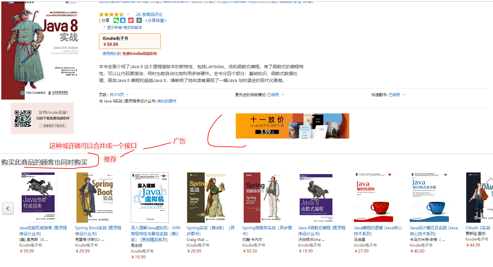

# 190. 商品详情页 OneService 系统：多服务接口合并设计介绍

之前我们都跟大家说过了，可能页面中需要相关联的几份数据，就不用一次又一次的发送 ajax 请求来获取多份数据，
直接就是一次请求发给一个 one service 系统的大接口，然后那个接口统一调用各个后端服务的接口就可以

**目的：** 减少浏览器和后端系统之间的交互次数

那么将哪些接口合并为一个接口呢？如何来设计接口的合并呢？

这个策略就很多，一般常见的策略是根据相邻的位置（页面中 ui 展示相邻的合并为一个接口），
比如第一屏有促销和部分广告，可以合并一下，在第一屏这两个一次就能拿回来需要展示的数据

还有比如以下的业务合并等

- 促销和广告，合并成一个接口，一次性发送请求过来，然后调用促销服务和广告服务，获取两份数据
- 库存服务，配送服务，合并成一个接口，一次性过来，获取当前有多少库存，如何配送
- 组合推荐服务+配件推荐服务+套装推荐服务，三个服务并发调用，合并结果

如上图的推荐和广告很近，往下拉的时候，基本上都需要加载出来。就适合合并起来

<iframe  height="500px" width="100%" frameborder=0 allowfullscreen="true" :src="$withBase('/ads.html')"></iframe>