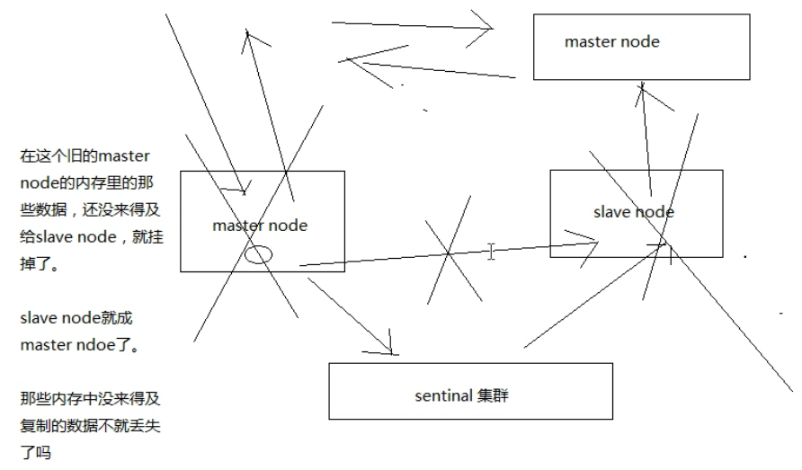
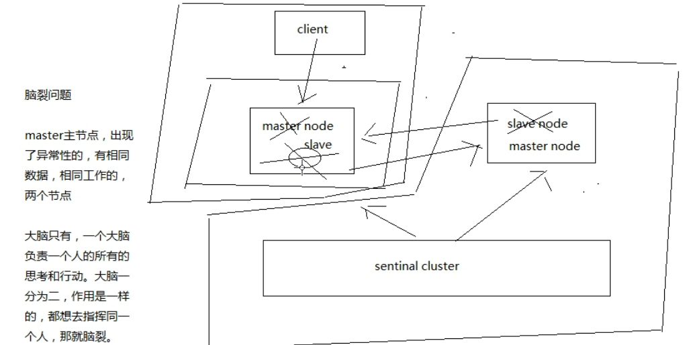
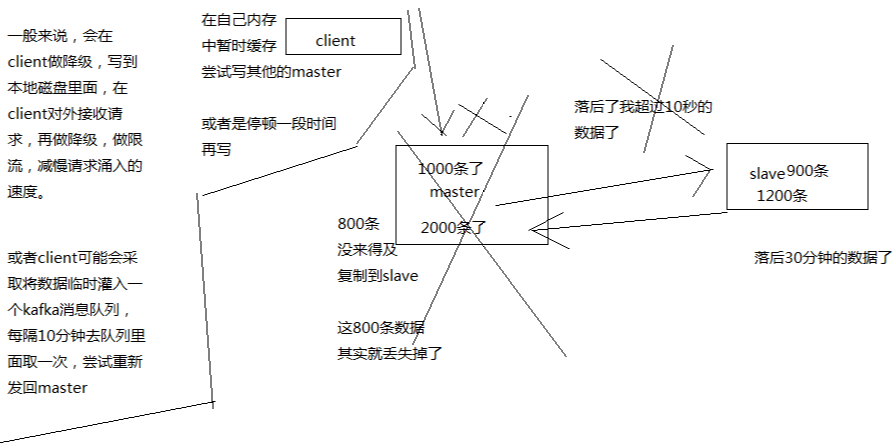

# 022. redis 哨兵主备切换的数据丢失问题：异步复制、集群脑裂
[[toc]]

## 两种数据丢失的情况

### 异步复制导致的数据丢失

因为 master -> slave 的复制是异步的，所以可能有部分数据还没复制到 slave，master 就宕机了，此时这些部分数据就丢失了

### 脑裂导致的数据丢失

何为脑裂？如上图由于一个集群中的 master 恰好网络故障，导致与 sentinal 联系不上了，sentinal 把另一个 slave 提升为了 master。此时就存在两个 master了。

当我们发现的时候，停止掉其中的一个 master，手动切换成 slave，当它连接到提升后的 master 的时候，会开始同步数据，那么自己脑裂期间接收的写数据就被丢失了

## 解决异步复制和脑裂导致的数据丢失
主要通过两个配置参数来解决

- min-slaves-to-write 1
- min-slaves-max-lag 10

如上两个配置：要求至少有 1 个 slave，数据复制和同步的延迟不能超过 10 秒，如果超过 1 个 slave，数据复制和同步的延迟都超过了 10 秒钟，那么这个时候，master 就不会再接收任何请求了

此配置保证就算脑裂了，那么最多只能有 10 秒的数据丢失

上图说明了脑裂时，master 拒绝写数据的时候，client 可能额外需要做的事情，client 是说使用方，不是 redis 的东西。

下图也是一样的道理，有如上两个参数配置控制的话，脑裂时会减少数据的丢失

<iframe  height="500px" width="100%" frameborder=0 allowfullscreen="true" :src="$withBase('/ads.html')"></iframe>