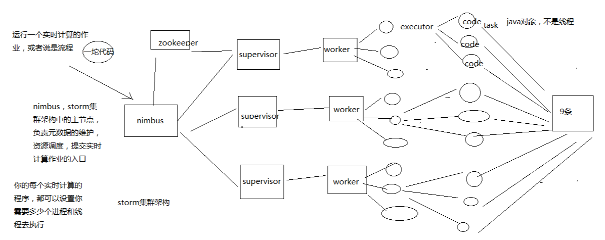
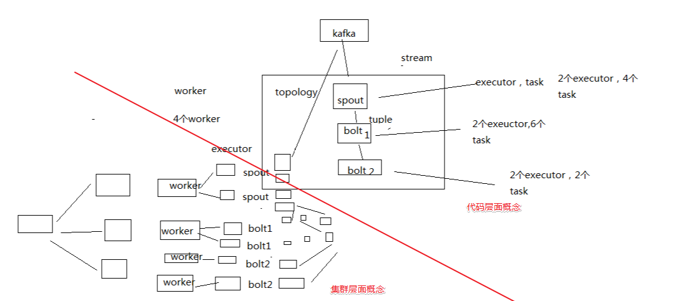

# 063. 大白话讲集群架构与核心概念

## Storm 的集群架构
Nimbus、Supervisor、ZooKeeper、Worker、Executor、Task

- Nimbus：资源调度
- Supervisor：相当于一台机器上的代理管家
- ZooKeeper：用于存放 Nimbus 和 Supervisor 的调度元数据信息
- Worker：根据配置可启动多个 worker 进程
- Executor：根据配置可启动多个线程
- Task：就是业务代码，不是线程，可能就是 stom 中你需要实现的业务代码

整体架构流程如图：一个事实计算作业启动后，Nimbus 通知 Supervisor 去启动 n 个 Worker，Worker 又启动 n 个 Executor，Executor 执行具体的 业务代码

## Storm 的核心概念

Topology、Spout、Bolt、Tuple、Stream

- Topology（拓扑）：虚的抽象的概念
- Spout：数据源代码组件

    可以理解为：用 java 实现一个 Spout 接口，在该代码中尝试去数据源获取数据，如 mysql、kafka
- Bolt：业务处理代码组件

    可以理解为：spout 会将数据传送给 bolt，各种 bolt 还可以串联成一个计算链条，同样是实现一个 bolt 接口

    一堆 spout + bolt，就会组成一个 topology（拓扑），也可以叫做一个实时计算作业；

    一个拓扑涵盖数据源获取/生产 + 数据处理的所有的代码逻辑
- Tuple：一条数据

    每条数据都会被封装在 tuple 中，在多个 spout 和 bolt 之间传递
- Stream：一个流

    虚的抽象的概念，源源不断过来的 tuple，就组成了一条数据流

了解了核心的基本概念之后，上图清晰的示意了他们是怎么配合工作的，
业务代码层面的概念通过配置，被调度到具体的机器上的集群概念中去执行

<iframe  height="500px" width="100%" frameborder=0 allowfullscreen="true" :src="$withBase('/ads.html')"></iframe>