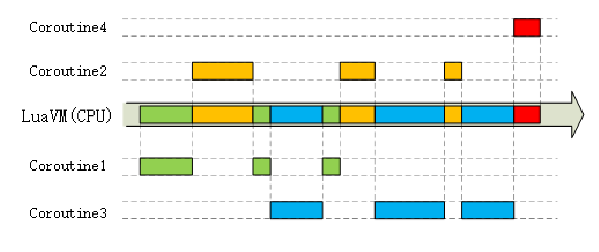

# 02 | OpenResty：更灵活的 Web 服务器

在上一讲里，我们看到了高性能的 Web 服务器 Nginx，它资源占用少，处理能力高，是搭建网站的首选。

虽然 Nginx 成为了 Web 服务器领域无可争议的王者，但它也并不是没有缺点的，毕竟它已经 15 岁了。

一个人很难超越时代，而时代却可以轻易超越所有人，Nginx 当初设计时针对的应用场景已经发生了变化，它的一些缺点也就暴露出来了。

Nginx 的服务管理思路延续了当时的流行做法，**使用磁盘上的静态配置文件，所以每次修改后必须重启才能生效** 。

这在业务频繁变动的时候是非常致命的（例如流行的微服务架构），特别是对于拥有成千上万台服务器的网站来说，仅仅增加或者删除一行配置就要分发、重启所有的机器，对运维是一个非常大的挑战，要耗费很多的时间和精力，成本很高，很不灵活，难以“随需应变”。

那么，有没有这样的一个 Web 服务器，它有 Nginx 的优点却没有 Nginx 的缺点，既轻量级、高性能，又灵活、可动态配置呢？

这就是我今天要说的 OpenResty，它是一个 **更好更灵活的 Nginx** 。

## OpenResty 是什么？

其实你对 OpenResty 并不陌生，这个专栏的实验环境就是用 OpenResty 搭建的，这么多节课程下来，你应该或多或少对它有了一些印象吧。

OpenResty 诞生于 2009 年，到现在刚好满 10 周岁。它的创造者是当时就职于某宝的神级程序员 **章亦春**，网名叫 `agentzh` 。

OpenResty 并不是一个全新的 Web 服务器，而是基于 Nginx，它利用了 Nginx 模块化、可扩展的特性，开发了一系列的增强模块，并把它们打包整合，形成了一个 **「一站式」的 Web 开发平台** 。

虽然 OpenResty 的核心是 Nginx，但它又超越了 Nginx，**关键就在于其中的 ngx_lua 模块** ，把小巧灵活的 Lua 语言嵌入了 Nginx，可以用脚本的方式操作 Nginx 内部的进程、多路复用、阶段式处理等各种构件。

脚本语言的好处你一定知道，它不需要编译，随写随执行，这就免去了 C 语言编写模块漫长的开发周期。而且 OpenResty 还把 Lua 自身的协程与 Nginx 的事件机制完美结合在一起，优雅地实现了许多其他语言所没有的 **同步非阻塞** 编程范式，能够轻松开发出高性能的 Web 应用。

目前 OpenResty 有两个分支，分别是开源、免费的 `OpenResty` 和闭源、商业产品的 `OpenResty+` ，运作方式有社区支持、OpenResty 基金会、OpenResty.Inc 公司，还有其他的一些外界赞助（例如 Kong、CloudFlare），正在蓬勃发展。


顺便说一下 OpenResty 的官方 logo，是一只展翅飞翔的海鸥，选择海鸥是因为 `鸥` 与 OpenResty 的发音相同。另外，这个 logo 的形状也像是左手比出的一个 `OK` 姿势，正好也是一个 `O` 。

## 动态的 Lua

刚才说了，OpenResty 里的一个关键模块是 ngx_lua，它为 Nginx 引入了脚本语言 Lua。

Lua 是一个比较「小众」的语言，虽然历史比较悠久，但名气却没有 PHP、Python、JavaScript 大，这主要与它的自身定位有关。


Lua 的设计目标是嵌入到其他应用程序里运行，为其他编程语言带来「脚本化」能力，所以它的个头比较小，功能集有限，不追求大而全，而是小而美，大多数时间都“隐匿”在其他应用程序的后面，是无名英雄。

你或许玩过或者听说过《魔兽世界》《愤怒的小鸟》吧，它们就在内部嵌入了 Lua，使用 Lua 来调用底层接口，充当 「胶水语言（glue language）」，编写游戏逻辑脚本，提高开发效率。

OpenResty 选择 Lua 作为「工作语言」也是基于同样的考虑。因为 Nginx C 开发实在是太麻烦了，限制了 Nginx 的真正实力。而 Lua 作为「最快的脚本语言」恰好可以成为 Nginx 的完美搭档，既可以简化开发，性能上又不会有太多的损耗。

作为脚本语言，Lua 还有一个重要的 **代码热加载** 特性，不需要重启进程，就能够从磁盘、Redis 或者任何其他地方加载数据，随时替换内存里的代码片段。这就带来了 **动态配置** ，让 OpenResty 能够永不停机，在微秒、毫秒级别实现配置和业务逻辑的实时更新，比起 Nginx 秒级的重启是一个极大的进步。

你可以看一下实验环境的 `www/lua` 目录，里面存放了我写的一些测试 HTTP 特性的 Lua 脚本，代码都非常简单易懂，就像是普通的英语阅读理解，这也是 Lua 的另一个优势：易学习、易上手。

## 高效率的 Lua

OpenResty 能够高效运行的一大秘技是它的 **同步非阻塞** 编程范式，如果你要开发 OpenResty 应用就必须时刻铭记于心。

同步非阻塞本质上还是一种 **多路复用** ，我拿上一讲的 Nginx epoll 来对比解释一下。

**epoll 是操作系统级别的多路复用** ，运行在内核空间。而 OpenResty 的同步非阻塞则是基于 Lua 内建的 **协程** ，是应用程序级别的多路复用，运行在用户空间，所以它的资源消耗要更少。

OpenResty 里每一段 Lua 程序都由协程来调度运行。和 Linux 的 epoll 一样，每当可能发生阻塞的时候协程就会立刻切换出去，执行其他的程序。这样单个处理流程是阻塞的，但整个 OpenResty 却是非阻塞的，多个程序都复用在一个 Lua 虚拟机里运行。



下面的代码是一个简单的例子，读取 POST 发送的 body 数据，然后再发回客户端：

```lua
ngx.req.read_body()                  -- 同步非阻塞 (1)
 
local data = ngx.req.get_body_data()
if data then
    ngx.print("body: ", data)        -- 同步非阻塞 (2)
end
```

代码中的 `ngx.req.read_body` 和 `ngx.print` 分别是数据的收发动作，只有收到数据才能发送数据，所以是 **同步** 的。

但即使因为网络原因没收到或者发不出去，OpenResty 也不会在这里阻塞干等着，而是做个记号，把等待的这段 CPU 时间用来处理其他的请求，等网络可读或者可写时再回来接着运行。

假设收发数据的等待时间是 10 毫秒，而真正 CPU 处理的时间是 0.1 毫秒，那么 OpenResty 就可以在这 10 毫秒内同时处理 100 个请求，而不是把这 100 个请求阻塞排队，用 1000 毫秒来处理。

除了同步非阻塞，OpenResty 还选用了 **LuaJIT** 作为 Lua 语言的运行时（Runtime），进一步挖潜增效。

LuaJIT 是一个高效的 Lua 虚拟机，支持 JIT（Just In Time）技术，可以把 Lua 代码即时编译成本地机器码，这样就消除了脚本语言解释运行的劣势，让 Lua 脚本跑得和原生 C 代码一样快。

另外，LuaJIT 还为 Lua 语言添加了一些特别的增强，比如二进制位运算库 bit，内存优化库 table，还有 FFI（Foreign Function Interface），让 Lua 直接调用底层 C 函数，比原生的压栈调用快很多。

## 阶段式处理

和 Nginx 一样，OpenResty 也使用流水线来处理 HTTP 请求，底层的运行基础是 Nginx 的阶段式处理，但它又有自己的特色。

Nginx 的流水线是由一个个 C 模块组成的，只能在静态文件里配置，开发困难，配置麻烦（相对而言）。而 OpenResty 的流水线则是由一个个的 Lua 脚本组成的，不仅可以从磁盘上加载，也可以从 Redis、MySQL 里加载，而且编写、调试的过程非常方便快捷。

下面我画了一张图，列出了 OpenResty 的阶段，比起 Nginx，OpenResty 的阶段更注重对 HTTP 请求响应报文的加工和处理。


OpenResty 里有几个阶段与 Nginx 是相同的，比如 rewrite、access、content、filter，这些都是标准的 HTTP 处理。

在这几个阶段里可以用 `xxx_by_lua` 指令嵌入 Lua 代码，执行重定向跳转、访问控制、产生响应、负载均衡、过滤报文等功能。因为 Lua 的脚本语言特性，不用考虑内存分配、资源回收释放等底层的细节问题，可以专注于编写非常复杂的业务逻辑，比 C 模块的开发效率高很多，即易于扩展又易于维护。

OpenResty 里还有两个不同于 Nginx 的特殊阶段。

一个是 **init 阶段** ，它又分成 `master init` 和 `worker init` ，在 master 进程和 worker 进程启动的时候运行。这个阶段还没有开始提供服务，所以慢一点也没关系，可以调用一些阻塞的接口初始化服务器，比如读取磁盘、MySQL，加载黑白名单或者数据模型，然后放进共享内存里供运行时使用。

另一个是 **ssl 阶段**，这算得上是 OpenResty 的一大创举，可以在 TLS 握手时动态加载证书，或者发送 `OCSP Stapling` 。

还记得 [我应该迁移到 HTTPS 吗?](../05/07.md) 里说的 `SNI 扩展` 吗？Nginx 可以依据「服务器名称指示来选择证书实现 HTTPS 虚拟主机」，但静态配置很不灵活，要编写很多雷同的配置块。虽然后来 Nginx 增加了变量支持，但它每次握手都要读磁盘，效率很低。

而在 OpenResty 里就可以使用指令 `ssl_certificate_by_lua` ，编写 Lua 脚本，读取 SNI 名字后，直接从共享内存或者 Redis 里获取证书。不仅没有读盘阻塞，而且证书也是完全动态可配置的，无需修改配置文件就能够轻松支持大量的 HTTPS 虚拟主机。

## 小结

1. Nginx 依赖于磁盘上的静态配置文件，修改后必须重启才能生效，缺乏灵活性；
2. OpenResty 基于 Nginx，打包了很多有用的模块和库，是一个高性能的 Web 开发平台；
3. OpenResty 的工作语言是 Lua，它小巧灵活，执行效率高，支持“代码热加载”；
4. OpenResty 的核心编程范式是 **同步非阻塞** ，使用协程，不需要异步回调函数；
5. OpenResty 也使用阶段式处理的工作模式，但因为在阶段里执行的都是 Lua 代码，所以非常灵活，配合 Redis 等外部数据库能够实现各种动态配置。

## 课下作业

1. 谈一下这些天你对实验环境里 OpenResty 的感想和认识。
2. 你觉得 Nginx 和 OpenResty 的“阶段式处理”有什么好处？对你的实际工作有没有启发？

<iframe  height="500px" width="100%" frameborder=0 allowfullscreen="true" :src="$withBase('/ads.html')"></iframe>