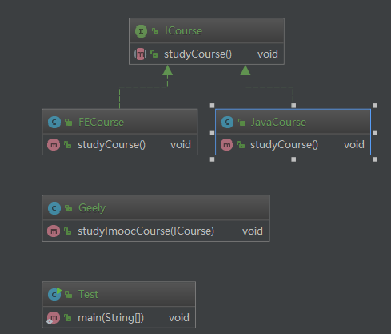

# 依赖倒置原则

**定义**：高层模块（指应用模块）不应该依赖底层模块，二者都应该依赖其抽象

* 抽象不应该依赖细节；细节应该依赖抽象
* 针对接口编程，不要针对实现编程

核心思想：面向接口编程

**优点**：

* 减少类之间的耦合性
* 提高系统稳定性
* 提高代码可读性和维护性
* 可降低修改程序锁造成的风险

## coding

场景：Geely 在慕课上学习课程，学习 Java 课程，学习前端课程。

```java
package cn.mrcode.newstudy.design.pattern.principle.dependencyinversion;

public class Geely {
    public void studyJavaCourse() {
        System.out.println("Geely 在学习 Java 课程");
    }

    public void studyFECourse() {
        System.out.println("Geely 在学习 FE 课程");
    }
}

```

```java
package cn.mrcode.newstudy.design.pattern.principle.dependencyinversion;

public class Test {
    public static void main(String[] args) {
        Geely geely = new Geely();
        geely.studyJavaCourse();
        geely.studyFECourse();
    }
}

```

```
Geely 在学习 Java 课程
Geely 在学习 FE 课程
```

现在的问题是：如果要再增加一门学习课程呢？那么解决的方案只能在 Geely 类中增加另外一门课程的方法，然后Test（应用层）再调用该方法

这破坏了_依赖倒置原则_，Test(应用层)依赖Geely（底层模块）。下面使用依赖倒置原则来进行修改

```java
public interface ICourse {
    void studyCourse();
}
```

```java
public class JavaCourse implements ICourse {
    @Override
    public void studyCourse() {
        System.out.println("Geely 在学习 Java 课程");
    }
}
```

```java
public class FECourse implements ICourse {
    @Override
    public void studyCourse() {
        System.out.println("Geely 在学习 FE 课程");
    }
}
```

```java
public class Geely {
    public void studyImoocCourse(ICourse iCourse) {
        iCourse.studyCourse();
    }
}
```

```java
public static void main(String[] args) {
    // v1 不使用依赖倒置原则
//        Geely geely = new Geely();
//        geely.studyJavaCourse();
//        geely.studyFECourse();
//        geely.studyPythonCourse();

    Geely geely = new Geely();
    geely.studyImoocCourse(new JavaCourse());
    geely.studyImoocCourse(new FECourse());
}
```



上面这个示例：

* geely 学习什么课程由 Test（应用层决定，高层模块）
* 再学习其他的课程，只需要扩展课程即可。而 geely 不需要变动
  - 在底层模块**扩展**
  - 是扩展课程，而不是去修改已有的 JavaCourse ，这也符合了_开闭原则_
* 面向接口编程，而不是面对 Geely
* Test 与 Geely 是解耦的
* Gelly 与 具体的课程实现是解耦的
* Gelly 与 ICourse 是有依赖的
* 所谓高内聚，低耦合，就是尽量减少耦合

这里只是一种写法，

* 由方法参数传递进去，
* 还可以从构造函数传递（不过这样一个 geely 实例就只能学习一种课程了）
* 还可以设置一个set方法，每次学习前，把课程set进去

```java
// v3
// Geely geely = new Geely(new JavaCourse());
// geely.studyImoocCourse();

Geely geely = new Geely();
geely.setCourse(new JavaCourse())
geely.studyImoocCourse();

geely.setCourse(new FECourse())
geely.studyImoocCourse();
```

依赖倒置原则表现了一种事实：

* 相对于细节的多变性，抽象的东西要稳定得多
* 以抽象搭建起来的架构，比以细节搭建起来的要稳定得多

那么抽象的目的也就是：制定好规范和契约，如 ICourse 就是一种规范契约


<iframe  height="500px" width="100%" frameborder=0 allowfullscreen="true" :src="$withBase('/ads.html')"></iframe>