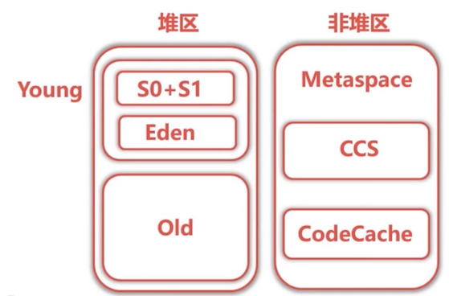

# JVM 内存结构：基于 JDK 1.8

> [Java SE 规范所有版本官方地址](https://docs.oracle.com/javase/specs/index.html)，包括语言规范和虚拟机规范

## 运行时数据区

> [JDK 8 官方运行时数据区文档](https://docs.oracle.com/javase/specs/jvms/se8/html/jvms-2.html#jvms-2.5)


Java 虚拟机定义了在程序执行期间使用的各种运行时数据区域。其中一些数据区域是在 Java 虚拟机启动时创建的，仅在 Java 虚拟机退出时才被销毁。其他数据区域是每个线程的。在创建线程时创建每个线程的数据区域，在线程退出时销毁每个数据区域。

### 程序计数器 /  Pc  Register

Java 虚拟机可以一次支持多个执行线程（JLS§17）。每个 Java 虚拟机线程都有其自己的   `Pc Register`（程序计数器）。在任何时候，每个 Java 虚拟机线程都在执行单个方法的代码，即该线程的当前方法：

- 如果不是 `native`，则该 `Pc Register` 包含当前正在执行的 Java 虚拟机指令的地址。
- 如果线程当前正在执行的方法是 `native`，则 Java 虚拟机的 `Pc Register` 值未定义。

### 虚拟机栈 / Java Virtual Machine Stacks

每个 Java 虚拟机线程都有一个私有 *Java 虚拟机堆栈* ，与该线程同时创建。Java 虚拟机堆栈类似于 C 之类的常规语言的堆栈：它保存局部变量和部分结果，并在方法调用和返回中起作用。因为除了入栈和出栈外，从不直接操纵 Java 虚拟机堆栈，所以可以为堆分配帧。Java 虚拟机堆栈的内存不必是连续的。

在第一版 *中的 Java ®虚拟机规范* ，Java 虚拟机堆被称为 *Java堆栈* 。

该规范允许 Java 虚拟机堆栈具有固定大小，或根据计算要求动态扩展和收缩。如果 Java 虚拟机堆栈的大小固定，则在创建每个 Java 虚拟机堆栈时可以独立选择它们的大小。

Java 虚拟机实现可以为程序员或用户提供对 Java 虚拟机堆栈的初始大小的控制，并且在动态扩展或收缩 Java 虚拟机堆栈的情况下，可以控制最大和最小大小。

以下异常条件与 Java 虚拟机堆栈相关：

- 如果线程中的计算所需的 Java 虚拟机堆栈超出允许的范围，则 Java 虚拟机将抛出 `StackOverflowError`。
- 如果可以动态扩展 Java 虚拟机堆栈，并尝试进行扩展，但是可以提供足够的内存来实现扩展，或者如果没有足够的内存来为新线程创建初始 Java 虚拟机堆栈，则可以使用 Java 虚拟机机器抛出一个 `OutOfMemoryError`。

#### 小结

**Java 虚拟机栈** 是线程私有的，它的生命周期与线程相同。它描述的是 Java 方法执行的内存模型：每个方法在执行的同时都会创建一个栈帧，用于存储局部变量表、操作数栈、动态链接、方法出口等信息，每一个方法从调用直至执行完成的过程，就对应着一个栈帧在虚拟机栈中入栈到出栈的过程。

### 堆 / Heap

Java 虚拟机具有一个在所有 Java 虚拟机线程之间共享的 **堆** 。堆是运行时数据区，**从中分配所有类实例和数组的内存**。

堆是在虚拟机启动时创建的。对象的堆存储由自动存储管理系统（称为 *垃圾收集器* ）*回收*；对象永远不会显式释放。Java 虚拟机不假定特定类型的自动存储管理系统，并且可以根据实现者的系统要求选择存储管理技术。堆的大小可以是固定的，也可以根据计算要求进行扩展，如果不需要更大的堆，则可以将其收缩。堆的内存不必是连续的。

Java 虚拟机实现可以为程序员或用户提供对堆初始大小的控制，并且，如果可以动态扩展或收缩堆，则可以控制最大和最小堆大小。

以下异常情况与堆相关联：

- 如果计算需要的堆多于自动存储管理系统可以提供的堆，则 Java 虚拟机将抛出一个  `OutOfMemoryError`。

#### 小结

Java 堆是 Java 虚拟机所管理的内存中最大的一块。堆是被所有线程共享的一块内存区域，在虚拟机启动时创建，此内存区域的唯一目的就是存放对象实例，几乎所有的对象实例都在这里分配内存。

Java 堆可以处于物理上不连续的内存空间中，只要逻辑上是连续的即可。

### 方法区 / Method Area

Java 虚拟机具有一个在所有 Java 虚拟机线程之间共享的 **方法区域**。该方法区域类似于常规语言的编译代码的存储区域，或者类似于操作系统过程中的 「文本」段。**它存储每个类的结构** ，例如运行时常量池，字段和方法数据，以及方法和构造函数的代码，包括用于类和实例初始化以及接口初始化的特殊方法。

方法区域是在 **虚拟机启动时创建的**。尽管方法区域在逻辑上是堆的一部分，但是简单的实现可以选择不进行垃圾回收或压缩。该规范没有规定方法区域的位置或用于管理已编译代码的策略。方法区域可以是固定大小的，或者可以根据计算的需要进行扩展，如果不需要更大的方法区域，则可以缩小。方法区域的内存不必是连续的。

Java 虚拟机实现可以为程序员或用户提供对方法区域初始大小的控制，并且在方法大小可变的情况下，可以控制最大和最小方法区域大小。

以下异常条件与方法区域相关联：

- 如果无法提供方法区域中的内存来满足分配请求，则 Java 虚拟机将抛出一个 `OutOfMemoryError`。

#### 小结

方法区与 Java 堆一样，是各个线程共享的内存区域，它用于存储已被虚拟机加载的类信息、常量、静态变量、即时编译器后的代码等数据。

虽然 Java 虚拟机规范把方法区描述为堆的一个逻辑部分，但是它却有一个别名叫做 `Non-Heap` （非堆），目的是与 Java 堆区分开来。

### 运行时常量池 / Run-Time Constant Pool

**运行时间常量池** 是方法区的一部分，Class 文件中除了有类的版本、字段、方法、接口等描述信息外，还有一项信息是常量池（Constant Pool Table），用于存放编译期生成的各种字面量和符号引用，这部分内容将在类加载后进入方法区的运行时常量池中存放。

以下异常条件与类或接口的运行时常量池的构造有关：

- 创建类或接口时，如果运行时常量池的构造需要的内存超过 Java 虚拟机的方法区域中可用的内存，则Java虚拟机将抛出 `OutOfMemoryError` 。

### 本地方法堆栈 / Native Method Stacks

Java 虚拟机的实现可以使用传统的堆栈（俗称 「C 堆栈」）来支持 `native` 方法（以 Java 编程语言以外的语言编写的方法）。解释程序的实现也可以使用诸如 C 之类的语言来解释 Java 虚拟机的指令集，以使用 `native`  本机方法栈。无法加载方法并且自身不依赖于常规堆栈的 Java 虚拟机实现无需提供本机方法栈。如果提供，通常在创建每个线程时为每个线程分配本机方法堆栈。

该规范允许本机方法堆栈具有固定大小，或者根据计算需要动态扩展和收缩。如果本机方法堆栈的大小固定，则在创建每个本机方法堆栈的大小时可以独立选择。

Java 虚拟机实现可以为程序员或用户提供对本机方法堆栈的初始大小的控制，并且在本机方法堆栈大小变化的情况下，可以控制最大和最小方法堆栈大小。

以下异常条件与本机方法堆栈相关联：

- 如果线程中的计算所需的本机方法堆栈超出允许的范围，则 Java 虚拟机将抛出  `StackOverflowError`。
- 如果可以动态扩展本机方法堆栈并尝试进行本机方法堆栈扩展，但可以提供足够的内存，或者可以提供足够的内存来为新线程创建初始本机方法堆栈，则 Java 虚拟机将抛出 `OutOfMemoryError`。

#### 小节

本地方法堆栈与虚拟机栈所发挥的作用是非常相似，他们之间的区别不过是虚拟机栈为虚拟机执行 Java 方法（字节码）服务，而本地方法栈则为虚拟机使用到的 Native 方法服务。

## JVM 的内存结构



### 非堆区

- Metaspace

  Class、Package、Method、Field、字节码、常量池、符号引用等

- CSS：32 位指针的 Class

- CodeCache：JIT 编译后的本地代码、JNI 使用的 C 代码

  

比如说：可以在 Tomcat 的 `bin/catalina.sh` 中配置如下参数：

```bash
# 大概在 269 行，第一次非注释出现的地方
JAVA_OPTS="$JAVA_OPTS -Xms128M -Xmx128M -XX:MetaspaceSize=128M -XX:MaxMetaspaceSize=128M -XX:+UseCompressedClassPointers"
```

重启 TOMCAT 后，查看他的 JC 信息

```bash
mrcode@mrcode ~ % jps -l
417 
867 
2135 
30776 org.apache.catalina.startup.Bootstrap
30781 sun.tools.jps.Jps

mrcode@mrcode ~ % jstat -gc 30776
 S0C    S1C    S0U    S1U      EC       EU        OC         OU       MC     MU    CCSC   CCSU   YGC     YGCT    FGC    FGCT     GCT   
9728.0 9216.0 2861.8  0.0   24576.0  15416.1   87552.0    35399.4   41472.0 40137.4 5120.0 4781.9     22    0.119   0      0.000    0.119
```

可以看到 CCSC 是 5120 KB，那么我们将它禁用掉

```bash
# 改成 - ：-XX:-UseCompressedClassPointers
JAVA_OPTS="$JAVA_OPTS -Xms128M -Xmx128M -XX:MetaspaceSize=128M -XX:MaxMetaspaceSize=128M -XX:-UseCompressedClassPointers"
```

重启后查看

```bash
mrcode@mrcode ~ % jps -l
417 
30834 sun.tools.jps.Jps
867 
2135 
30825 org.apache.catalina.startup.Bootstrap

mrcode@mrcode ~ % jstat -gc 30825
 S0C    S1C    S0U    S1U      EC       EU        OC         OU       MC     MU    CCSC   CCSU   YGC     YGCT    FGC    FGCT     GCT   
8704.0 9216.0  0.0   2161.4 24576.0   9539.1   87552.0    36188.3   39680.0 38174.0  0.0    0.0       23    0.116   0      0.000    0.116
```

CCSC 和 CCSU 都变成 0 了

## 常用参数

- `-Xms -Xmx` ：堆内存大小
- `-XX:NewSize -XX:MaxNewSize`：新生代，young 区
- `-XX:NewRatio ` ：新生代 和 old 区的一个比例
- `-XX:MaxSurvivorRatio` ：Eden 区和 Survivor 区的比例
- `-XX:MetaspaceSize -XX:MaxMetaspaceSize` ：Metaspace 大小
- `-XX:UseCompressedClassPointers`：是否启用压缩的类指针
- `-XX:CompressedClassSpaceSize`：设置类压缩占用空间
- `-XX:InitialCodeCacheSize`：CodeCache 初始大小
- `-XX:ReservedCodeCacheSize`：CodeCache 最大大小

Metaspace 后面的这几个一般都不需要调整，只需要调整 MetaspaceSize 大小，因为他们都是包含在 MetaspaceSize 中的

<iframe  height="500px" width="100%" frameborder=0 allowfullscreen="true" :src="$withBase('/ads.html')"></iframe>