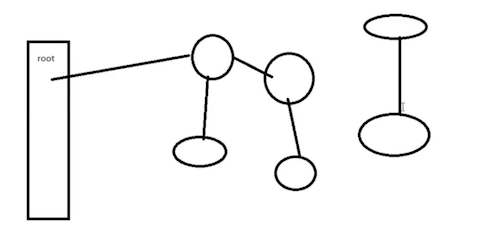

---
tags:
---

# 垃圾回收算法

JDK 使用了一种算法，它的思想是：**枚举根节点，做可达性分析**

如上图所示，从根节点开始，引用了哪些对象，一层一层下去，最右侧的不可达，则它是一个垃圾

根节点有：类加载器、Thread、虚拟机栈的本地变量表、static 成员、常量引用、本地方法栈的变量等等。

确定垃圾之后，下面来介绍常用的垃圾回收方法

##  标记清除

算法：分为「标记」和「清除」两个阶段：

- 标记：首先标记出所有需要回收的对象
- 清除：在标记完成后统一回收所有

缺点：

- 效率不高：标记和清除两个过程的效率都不高
- 产生碎片：碎片太多会导致提前 GC

## 复制

它将可用内存按容量划分为大小相等的两块，每次只使用其中的一块。当这一块的内存用完了，就将还存活的对象复制到另外一块上面，然后再把自己使用过的内存空一次清理掉。

这种方式前面的 S0 和 S1 区就是使用的这种方式。

优缺点：实现简单，运行高效，但是空间利用率低。

## 标记整理

标记过程任然与 「标记清除」算法一样，但是后续步骤不是直接对可回收对象进行清理，而是让所有存活的对象都向一端移动，然后直接清理掉端边界以外的内存。

优缺点：没有了内存碎片，但是整理内存比较耗时。

## 分带垃圾回收

- Young 区用复制算法

  大部分对象生命周期非常短，存活的对象非常少，使用复制算法效率很高

- Old 区用标记清除或标记整理

  存放的对象，生命周期都是比较长的，垃圾相对较少，使用标记清除或标记整理较好

## 对象分配

- 对象优先在 Young 区中的 Eden 区分配

- 但是大对象会直接进入老年代 Old 区

  对象的大小是通过 `-XX:PretenureSizeThreshold` 来定义的

- 长期存活的对象，将进入老年代

  `-XX:MaxTenuringThredhold`：最大年龄

  `-XX:+PrintTenuringDistribution`：发生 Young GC 的时候打印存活对象的年龄分布信息

  `-XX:TargetSurvivorRatio`：比例

  在 Young 区的对象，不会一直存在 Young 区，经过几次垃圾回收，还存在 Young 区的则会晋升到 Old 区，每个对象都会有一个类型 **年龄** 的概念，每经过一次 Young GC，存活下来的对象年龄 + 1

  当对象的年龄到达  `MaxTenuringThredhold` 岁时，将进入 Old 区

  每次 Young GC 后，存活的对象如果大于 `TargetSurvivorRatio`  该值，则计算存活对象的平均年龄，达到该平均年龄的对象也会进入 Old 区

  <iframe  height="500px" width="100%" frameborder=0 allowfullscreen="true" :src="$withBase('/ads.html')"></iframe>