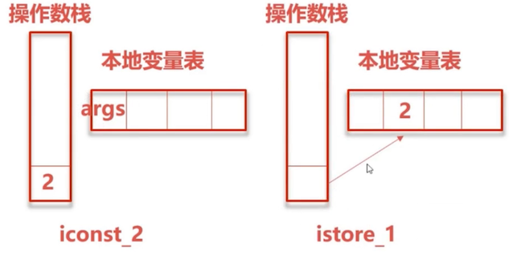
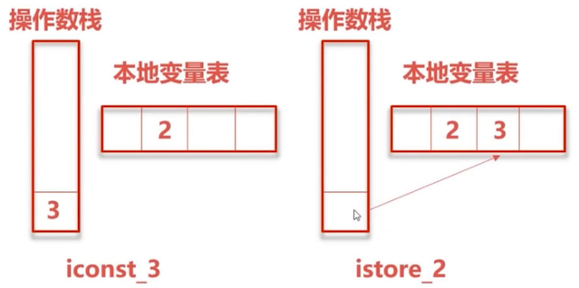
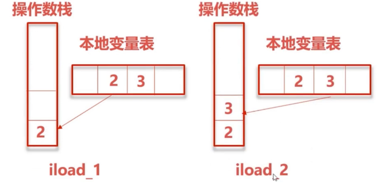
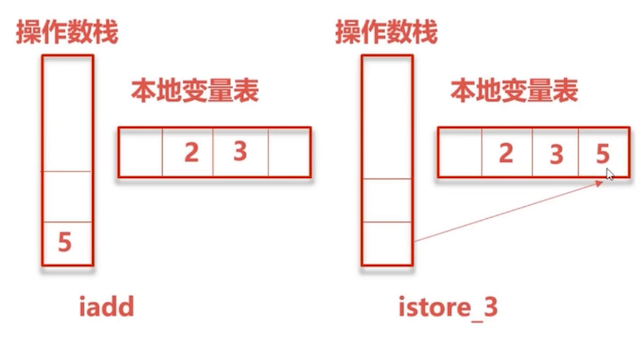
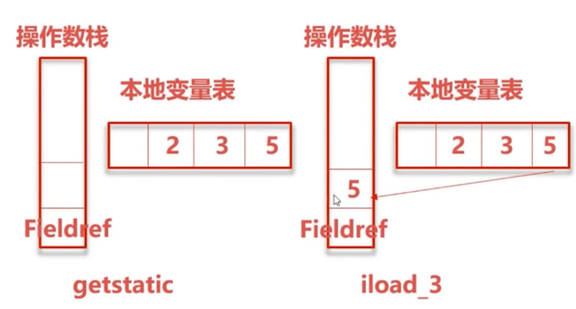

# JVM 字节码指令与 javap

```bash
用法: javap <options> <classes>
其中, 可能的选项包括:
  -help  --help  -?        输出此用法消息
  -version                 版本信息
  -v  -verbose             输出附加信息
  -l                       输出行号和本地变量表
  -public                  仅显示公共类和成员
  -protected               显示受保护的/公共类和成员
  -package                 显示程序包/受保护的/公共类
                           和成员 (默认)
  -p  -private             显示所有类和成员
  -c                       对代码进行反汇编
  -s                       输出内部类型签名
  -sysinfo                 显示正在处理的类的
                           系统信息 (路径, 大小, 日期, MD5 散列)
  -constants               显示最终常量
  -classpath <path>        指定查找用户类文件的位置
  -cp <path>               指定查找用户类文件的位置
  -bootclasspath <path>    覆盖引导类文件的位置
```

下面是一些官方文档地址：

- [JAVA 虚拟机规范](https://docs.oracle.com/javase/specs/jvms/se8/html/index.html)

- [常量池]( https://docs.oracle.com/javase/specs/jvms/se8/html/jvms-4.html#jvms-4.4)
- [虚拟机指令集](https://docs.oracle.com/javase/specs/jvms/se8/html/jvms-6.html)：查阅各个指令的含义

## 查看一个 class 文件的字节码信息

> [CLass 文件格式官方文档](https://docs.oracle.com/javase/specs/jvms/se8/html/jvms-4.html#jvms-4.4) 再次强调：本节内容知识，要想明白最好通读下官方文档的说明，里面讲得很详细

```java
package cn.mrcode.stady.monitor_tuning.chapter8;

public class Test1 {
    public static void main(String[] args) {
        int a = 2;
        int b=3;
        int c = a+b;
        System.out.println(c);
    }
}

```

使用 IDEA 开发的话，直接找到 class 目录（这个要看你用的是什么打包工具），笔者是 gradle

```bash
# 进入到该文件的 class 文件
cd /Users/mrcode/IdeaProjects/monitor-tuning/build/classes/java/main/cn/mrcode/stady/monitor_tuning/chapter8

#输出到指定文件
javap -v Test1.class > test1.txt
```

test1.txt 文件内容如下，里面就是对应的字节码内容

```java
Classfile /Users/mrcode/IdeaProjects/monitor-tuning/build/classes/java/main/cn/mrcode/stady/monitor_tuning/chapter8/Test1.class
  Last modified 2021-2-7; size 659 bytes
  MD5 checksum 354fdbdbbc2263bb6c52bf320134a8d9
  Compiled from "Test1.java"
// 类名与 JDK 版本号
public class cn.mrcode.stady.monitor_tuning.chapter8.Test1
  minor version: 0
  major version: 52
  flags: ACC_PUBLIC, ACC_SUPER  // 访问标识符

// 常量池
// 里面的引用都是符号引用，在运行时会转成直接引用
Constant pool: 
   // 方法引用，部分常量后面的注释是引用的内容，可以跳到具体的常量查看
   // 也可以直接看后面的注释内容
   #1 = Methodref          #5.#24         // java/lang/Object."<init>":()V
   #2 = Fieldref           #25.#26        // java/lang/System.out:Ljava/io/PrintStream;
   #3 = Methodref          #27.#28        // java/io/PrintStream.println:(I)V
   // 第 4 个常量是一个 Class 引用了 #29 这个常量
   #4 = Class              #29            // cn/mrcode/stady/monitor_tuning/chapter8/Test1
   #5 = Class              #30            // java/lang/Object
   // 构造函数  
   #6 = Utf8               <init>
   #7 = Utf8               ()V
   #8 = Utf8               Code
   #9 = Utf8               LineNumberTable
  #10 = Utf8               LocalVariableTable
  #11 = Utf8               this
  #12 = Utf8               Lcn/mrcode/stady/monitor_tuning/chapter8/Test1;
  #13 = Utf8               main
  #14 = Utf8               ([Ljava/lang/String;)V
  #15 = Utf8               args
  #16 = Utf8               [Ljava/lang/String;
  #17 = Utf8               a
  #18 = Utf8               I
  #19 = Utf8               b
  #20 = Utf8               c
  #21 = Utf8               MethodParameters
  #22 = Utf8               SourceFile
  #23 = Utf8               Test1.java
  #24 = NameAndType        #6:#7          // "<init>":()V
  #25 = Class              #31            // java/lang/System
  #26 = NameAndType        #32:#33        // out:Ljava/io/PrintStream;
  #27 = Class              #34            // java/io/PrintStream
  #28 = NameAndType        #35:#36        // println:(I)V
  // #29 常量，是一个 Utf8，即是一个字符串                          
  #29 = Utf8               cn/mrcode/stady/monitor_tuning/chapter8/Test1
  #30 = Utf8               java/lang/Object
  #31 = Utf8               java/lang/System
  #32 = Utf8               out
  #33 = Utf8               Ljava/io/PrintStream;
  #34 = Utf8               java/io/PrintStream
  #35 = Utf8               println
  #36 = Utf8               (I)V
                            
{
  public cn.mrcode.stady.monitor_tuning.chapter8.Test1();
    descriptor: ()V  // 构造函数，返回是 void
    flags: ACC_PUBLIC
    Code:
      stack=1, locals=1, args_size=1
         0: aload_0
         1: invokespecial #1                  // Method java/lang/Object."<init>":()V
         4: return
      LineNumberTable:
        line 3: 0
      LocalVariableTable:
        Start  Length  Slot  Name   Signature
            0       5     0  this   Lcn/mrcode/stady/monitor_tuning/chapter8/Test1;

  // main 函数
  public static void main(java.lang.String[]);
    descriptor: ([Ljava/lang/String;)V
    flags: ACC_PUBLIC, ACC_STATIC
    Code: // code 里面的内容也就是我们在 psvm 里面编写的类容的字节码
      // 操作栈的深度为 2
      // 本地变量表最大长度（slot 为单位），64 位是 2，其他是 1，索引从 0 开始，
         // 如果是非 static 方法，索引 0 代表 this，后面是入参
         // 本地变量表在这个信息的最后面有也就是：LocalVariableTable
      // 有 1 个参数
      stack=2, locals=4, args_size=1
         0: iconst_2		// 常量 2 压栈
         1: istore_1		// 出栈保存到本地变量 1 里面
         2: iconst_3		// 常量 3 压栈
         3: istore_2		// 出栈保存到本地变量 2 里面
         4: iload_1		  // 局部变量 1 压栈
         5: iload_2		  // 局部变量 2 压栈
         6: iadd		    // 栈顶两个元素相加，计算结果压栈
         7: istore_3	  // 出栈保存到局部变量 3 里面
         8: getstatic     #2                  // Field java/lang/System.out:Ljava/io/PrintStream;
        11: iload_3
        12: invokevirtual #3                  // Method java/io/PrintStream.println:(I)V
        15: return
      // 行号表
        // line 5: 对应文件里面的代码行号
        // 0：代表的是 code 里面的前面的操作步骤
      LineNumberTable:
        line 5: 0
        line 6: 2
        line 7: 4
        line 8: 8
        line 9: 15
      // 本地变量表
      LocalVariableTable:
        Start  Length  Slot  Name   Signature
            0      16     0  args   [Ljava/lang/String;
            2      14     1     a   I
            4      12     2     b   I
            8       8     3     c   I
    MethodParameters:
      Name                           Flags
      args
}
SourceFile: "Test1.java"

```

### 字段描述符 

| *FieldType* term <br/> 字节类型 | Type<br/> 原码类型 | Interpretation                                               |
| ------------------------------- | ------------------ | ------------------------------------------------------------ |
| `B`                             | `byte`             | signed byte                                                  |
| `C`                             | `char`             | Unicode character code point in the Basic Multilingual Plane, encoded with UTF-16 |
| `D`                             | `double`           | double-precision floating-point value                        |
| `F`                             | `float`            | single-precision floating-point value                        |
| `I`                             | `int`              | integer                                                      |
| `J`                             | `long`             | long integer                                                 |
| `L` *ClassName* `;`             | `reference`        | 引用类型，是这个类的一个实例                                 |
| `S`                             | `short`            | signed short                                                 |
| `Z`                             | `boolean`          | `true` or `false`                                            |
| `[`                             | `reference`        | 数组实例                                                     |

### 方法描述符

方法描述符：

```
Object m(int i, double d, Thread t) {...}
```

字节码中是这样的:

```bash
(IDLjava/lang/Thread;)Ljava/lang/Object;
# IDL: 是方法的参数类型，也就是字段描述符对应的含义
```

需要注意的是的二进制名称的内部形式 `Thread` 和 `Object` 使用。

## 基于栈的架构

jvm 执行指令是基于栈的架构，还有听到最多的是基于寄存器的架构。

我们具体关注一下代码信息

```java
public static void main(String[] args) {
  int a = 2;
  int b=3;
  int c = a+b;
  System.out.println(c);
}
```

以上代码对应的指令是下面这个

```java
         // int a = 2 对应下面两个指令操作
         // 含义是：将常量 2 压入栈，然后出栈将值赋给本地变量 2
				 0: iconst_2		// 常量 2 压栈
         1: istore_1		// 出栈保存到本地变量 1 里面
         // int b = 3
         2: iconst_3		// 常量 3 压栈
         3: istore_2		// 出栈保存到本地变量 2 里面
         // int c = a + b
         4: iload_1		  // 本地变量 1 压栈
         5: iload_2		  // 本地变量 2 压栈
         6: iadd		    // 栈顶两个元素相加，计算结果压栈
         7: istore_3	  // 出栈保存到本地变量 3 里面
         // System.out.println(c);
         // 是一个 Fieldref 引用， 引用了常量池中的 #2，获取了一个静态方法
         8: getstatic     #2                  // Field java/lang/System.out:Ljava/io/PrintStream;
        11: iload_3			// 本地变量 3 压栈，也就是计算结果
        // 这里执行了 #3 引用，也就是 println 方法
        12: invokevirtual #3                  // Method java/io/PrintStream.println:(I)V
        15: return
```

使用图示表示如下：

将 2 赋值到本地变量表 1



将 3 赋值到本地变量表 2



将本地变量表 1、2 压栈



计算栈顶两个数值的值，留在栈中的一个元素则是计算后的结果，将该结果出栈，存储在本地变量表 3 中



获取了一个静态方法的引用，并将本地变量 3 压栈，形成一个引用和一个参数



执行方法，并返回结束该 main 函数


以上指令集的含义，请仔细阅读官方文档，这里以 [invokevirtual](https://docs.oracle.com/javase/specs/jvms/se8/html/jvms-6.html#jvms-6.5.invokevirtual) 来举例，如何看懂这个文档

> #### Operation
>
> Invoke instance method; dispatch based on class
>
> 调用实例方法;基于类的调度
>
> #### Format
>
>
> *invokevirtual*
> *indexbyte1*
> *indexbyte2*
>
> #### Forms
>
> *invokevirtual* = 182 (0xb6)
>
> #### Operand Stack / 对操作数栈的要求
>
> ..., *objectref*, [*arg1*, [*arg2* ...]] →
>
> ...
>
> 里面需要现有一个 objectref ，对应本例则是  getstatic
>
> 后面需要有该方法的参数，对应本例则是 iload_3
>
> 有了这两个，就可以执行 *invokevirtual* 指令了

对于官方的英文文档，如果看不懂的话，可以去百度该指令，英文对于指令来说，它的变化是不怎么频繁的

<iframe  height="500px" width="100%" frameborder=0 allowfullscreen="true" :src="$withBase('/ads.html')"></iframe>